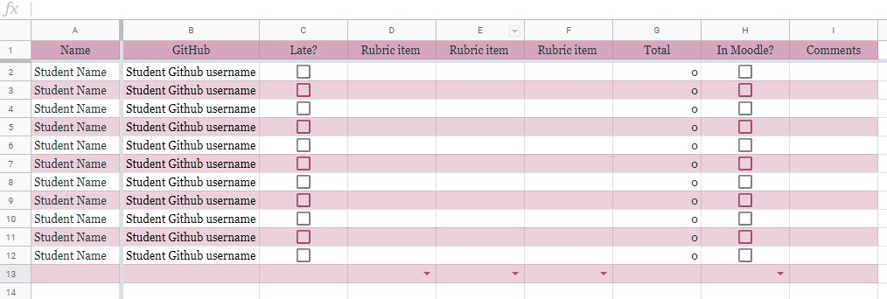
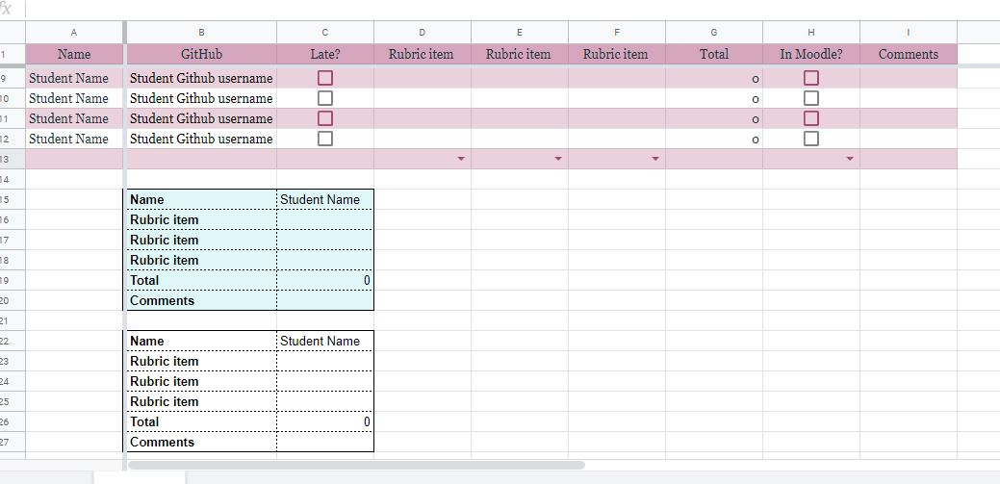
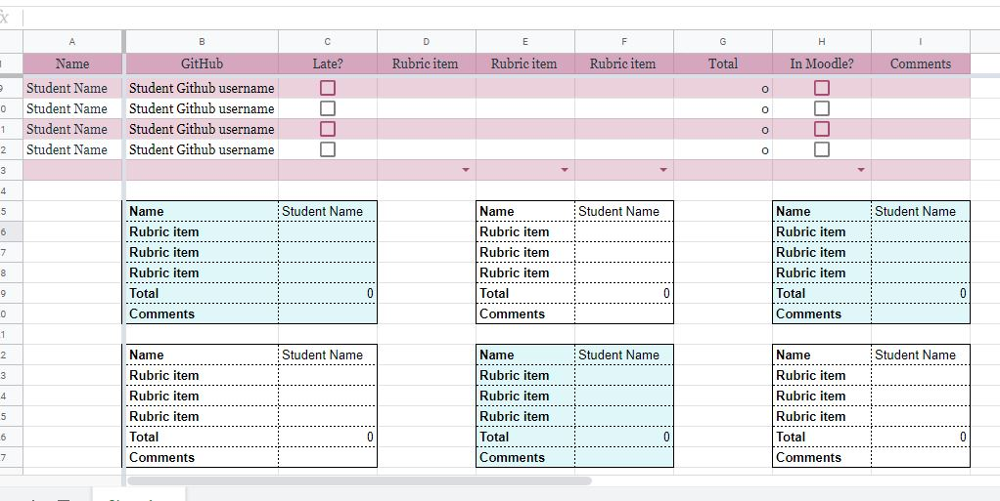

# Google Sheets Individual Rubric Script
This is the code for a Google Script tool written to be used with the grading system used by Berea College Computer Science Teaching Assistants and was written by TA William Romano. 

This is the script Will wrote that gathers student grade information and then appends them to the sheet in individual format. 

Here is an example of what the grading sheet looks like that this script was written for: 

The drop-down boxes at the bottom are used to indicate which TA graded which column, because we use a vertical grading system. 

## Instructions to Install:
1. Copy all of the code for whichever version you want to use. **Version A** places them all in vertical order, and is located on the branch called "Version A". **Version B** places three in a horizontal row, and is located on the branch called "Version B".

2. Open up the **Tools** tab in the Google Sheets workbook and click on the *Script editor* button. 

3. Replace the given code with the code you copied on the page that opens and save the program. 

4. Now, refresh your Google Sheet and there should be a new tab at the top bar called **Post to Moodle**.

5. If you click on that tab, and click on the *Format Individual Data* option, a new screen will pop up, stating that it is an unsafe program and you need to authorize it. Click continue. You’ll choose the account you want to use, and then it will say that this app isn’t verified, that is fine. You will need to click advanced settings, located in the bottom left-hand corner of that window. There will be another option in the bottom that says *Go to 'Script Name' (unsafe)*, click on that and it will take you to a new page. On this page, click allow to allow your program to run this app. You will probably get an email about the authorization each time to have to complete step 5. 

#### Here is an example of the results of Version A: 

#### Here is an example of the results of Version B:

As you may notice, there are some columns that are not visible in the rubrics created by the program. These are our administrative columns that are used by us to keep track of various items. The code was written to skip these columns. The code was written to skip these columns because this is information that students don't need to see. 

